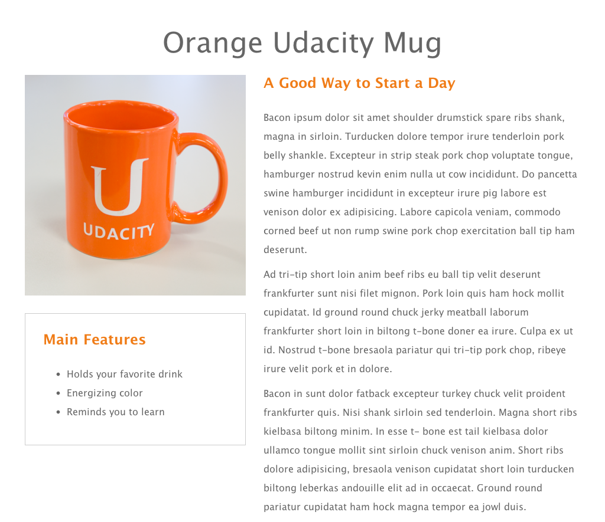
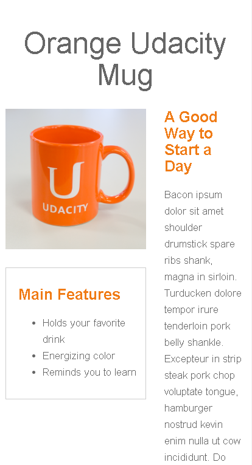

# Conversão de Mockup para HTML com Bootstrap Flexbox
## Projeto Bootstrap Flexbox Mockup

1. Conversão de um protótipo de design (imagem) em uma página web, utilizando HTML e CSS com Bootstrap.
2. Foi utilizado o utilitário Flexbox do Bootstrap para acomodar diferentes tamanhos de telas.<!-- **Bootstrap flexbox utility was used so the page layout accommodate different screen sizes and different display devices.**  -->
3. Este projeto foi concluído com sucesso como uma das tarefas para concluir o curso da especialização Frontend Developer Nanodegree da [Udacity] (https://br.udacity.com).

### Preview:

## O mockup está na forma de um arquivo imagem do tipo png e tem a sua aparência na seguinte forma:

Mockup:

## Podemos ver que o layout da página se modifica quando alteramos o tamanho da janela do browser, simulando dispositivos com uma tela menor:
<!--We can see the page layout changes as we resize the browser window: -->

